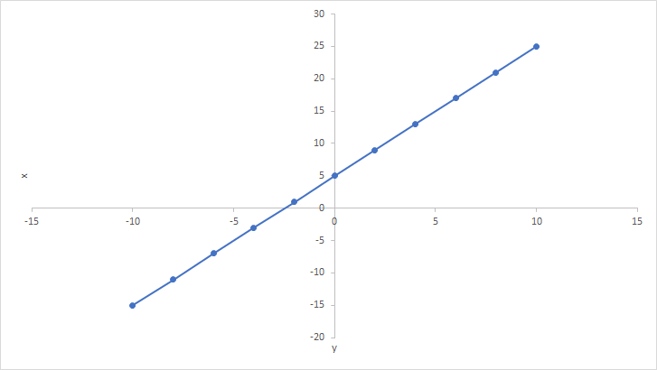
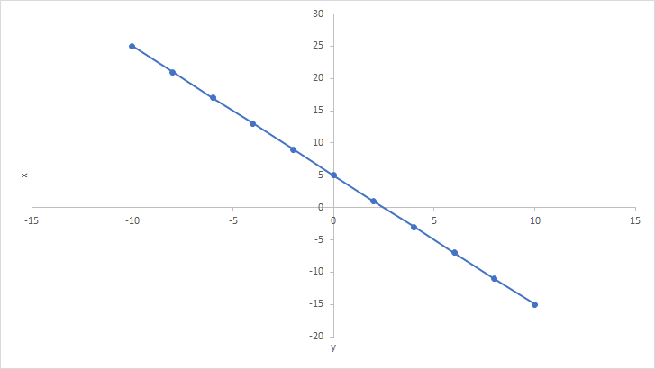

# Регресија (линеарна)

## Линеарна функција (математика)

У математици линеарне функције представљају се као $f(x)=ax+b$, где
$a,b\in{\mathbb{R}}$ и $a\neq{0}$. График линеарне функције је права. Ако је
$a>0$ онда права гради оштар угао са позитивним делом $x$-осе...

<figure markdown="span">
  { width="480" }
  <figcaption>Растућа линеарана функција</figcaption>
</figure>

...односно, ако је $a<0$ онда је тај угао туп:

<figure markdown="span">
  { width="480" }
  <figcaption>Опадајућа линеарана функција</figcaption>
</figure>

## Линеарни модел (статистика)

У статистици, линеарни модел може се представити са два приступа. Први приступ
$Y=aX+b$, подразумева да је $Y$ потпуно одређено ако је познато $X$. Посматране
означене вредности представљају се са $(x_i,y_i)$.

На пример, ако посматраш зависност температуре у Целзијусима и Фаренхајтима...

$$T_F=(\frac{9}{5}T_C)+32$$

...за сваку дату температуру у Целзијусима тачно можеш одредити температуру у
Фаренхајтима...

| Температура $^\circ{C}$ | Температура $^\circ{F}$ |
|-------------------------|-------------------------|
| -40                     | -40                     |
| -35                     | -31                     |
| -30                     | -22                     |
| -25                     | -13                     |
| -20                     | -4                      |
| -15                     | 5                       |
| -10                     | 14                      |
| -5                      | 23                      |
| 0                       | 32                      |
| 5                       | 41                      |
| 10                      | 50                      |
| 15                      | 59                      |
| 20                      | 68                      |
| 25                      | 77                      |
| 30                      | 86                      |
| 35                      | 95                      |
| 40                      | 104                     |

што можеш представити и графиком функције:

<figure markdown="span">
  { width="480" }
  <figcaption>Целзијуси у Фаренхајте</figcaption>
</figure>

Овај приступ где је вредност $Y$ потпуно одређена вредношћу $X$ није баш
"интересантан". Интересантно би било да на основу $X$ превдивиш вредност $Y$.
На пример, да на основу квадратуре стана предвидиш цену стана. Ако погледаш
податке о продаји станова видећеш да постоје одступања и да цена стана не може
да се одреди прецизно на основу квадратуре стана.

<figure markdown="span">
  { width="480" }
  <figcaption>Цене станова на основу квадратуре</figcaption>
</figure>

То значи да постоје варијације вредности $Y$ које нису потпуно одређене
вредношћу $X$, па у другом приступу $E[Y|X]=aX+b$, $E[Y|X]$ представља израз
условног очекивања. Значи, очекивана вредност $Y$ за дато $X$ је $aX+b$.

Пошто важи да је $E[E[Y|X]]=E[Y]$, онда важи и:

$$E[Y]=aE[X]+b$$

$$b=E[Y]-aE[X]$$

$$a=\frac{коваријанса(X,Y)}{варијанса(X,Y)}$$

Права на графикону изнад не пролази кроз све тачке на графикону, што значи да
постоје разлике очекиваним и предвиђеним вредностима, односно да постоје
грешке! Да би израчунао укупну грешку модела, није добро да сабираш вредности
појединачних грешака, пошто су неке позитивне, а неке негативне. Грешке требаш
прво квадрирати, потом сабрати, па добијени поделити са укупним бројем грешака,
што резултује средњеквадратном грешком (енгл. *Mean Squared Error - MSE*). У
овом случају:

$$\frac{1}{n}\sum_{i=0}^n(y_i-ax_i-b)^2$$

У овој лекцији нећемо се више бавити теоријом вероватноће и статистиком - битно
је само да видиш како је линеарни регресиони модел математички формализован.

$X$ се често назива **независна променљива**, **предикторска променљива**,
**фактор** или **регресор**, а $Y$ **зависна променљива** или
**критеријумска променљива**.

Независна променљивих није увек једна вредност односно **скалар**. Она може
бити и **вектор**, **матрица** или **тензор**.

Скалар (*0-way tensor*):

$$[1]$$

Вектор (*1-way tensor*):

$$\begin{bmatrix}
1 & 2 & 3 \\
\end{bmatrix}
\text{  или  }
\begin{bmatrix}
1 \\
2 \\
3 \\
\end{bmatrix}$$

Матрица (*2-way tensor*):

$$\begin{bmatrix}
1 & 2 & 3 \\
4 & 5 & 6 \\
7 & 8 & 9 \\
\end{bmatrix}$$

Тензор (*3-way tensor*):

$$\begin{bmatrix}
[11\ 12\ 13] & [14\ 15\ 16] & [17\ 18\ 19] \\
[21\ 22\ 23] & [24\ 25\ 26] & [27\ 28\ 29] \\
[31\ 32\ 33] & [34\ 35\ 36] & [37\ 38\ 39] \\
\end{bmatrix}$$

На пример, цена стана не зависи само од квадратуре, већ и од спрата, локације,
стања, опремљености, старости објекта итд.

## Линеарна регресија (ML.NET)

Линеарна регресија је задатак **надгледаног машинског учења** који се користи
за предвиђање вредности ознаке из скупа повезаних функција. Ознака може бити
било које реалне вредности. Алгоритми линеарне регресије моделирају зависност
ознаке од њених сродних карактеристика да би одредили како ће се ознака мењати
у зависности од промена вредности карактеристика.

Улаз алгоритма линеарне регресије је скуп примера са ознакама познатих
вредности, док је излаз функција коју можеш користити да предвидиш вредност
ознаке за било који нови скуп улазних карактеристика.

Неки примери сценарија где можеш применити модел линеарне регресије:

* Предвиђање цена кућа на основу атрибута куће као што су број спаваћих соба,
локација или величина.
* Предвиђање будућих цена акција на берзи на основу историјских података и
тренутних тржишних трендова.
* Предвиђање продаје производа на основу буџета за оглашавање.

Модел можеш обучавати помоћу једног од следећих алгоритама:

* [LbfgsPoissonRegressionTrainer](https://learn.microsoft.com/en-us/dotnet/api/microsoft.ml.trainers.lbfgspoissonregressiontrainer)
* [LightGbmRegressionTrainer](https://learn.microsoft.com/en-us/dotnet/api/microsoft.ml.trainers.lightgbm.lightgbmregressiontrainer)
* [SdcaRegressionTrainer](https://learn.microsoft.com/en-us/dotnet/api/microsoft.ml.trainers.sdcaregressiontrainer)
* [OlsTrainer](https://learn.microsoft.com/en-us/dotnet/api/microsoft.ml.trainers.olstrainer)
* [OnlineGradientDescentTrainer](https://learn.microsoft.com/en-us/dotnet/api/microsoft.ml.trainers.onlinegradientdescenttrainer)
* [FastTreeRegressionTrainer](https://learn.microsoft.com/en-us/dotnet/api/microsoft.ml.trainers.fasttree.fasttreeregressiontrainer)
* [FastTreeTweedieTrainer](https://learn.microsoft.com/en-us/dotnet/api/microsoft.ml.trainers.fasttree.fasttreetweedietrainer)
* [FastForestRegressionTrainer](https://learn.microsoft.com/en-us/dotnet/api/microsoft.ml.trainers.fasttree.fastforestregressiontrainer)
* [GamRegressionTrainer](https://learn.microsoft.com/en-us/dotnet/api/microsoft.ml.trainers.fasttree.gamregressiontrainer)

Подаци колоне улазне ознаке морају бити `Single`.

Тренери за овај задатак дају следеће:

| Име излаза | Тип      | Опис                                       |
|------------|----------|--------------------------------------------|
| `Score`    | `Single` | Необрађен резултат који је предвидео модел |

## Задатак

Користећи дати скуп података...

[taxi-fare-train.csv](https://raw.githubusercontent.com/dotnet/machinelearning/main/test/data/taxi-fare-train.csv)

...креирај C# .NET (6.0 или 8.0) конзолну апликацију за предвиђање цене такси
превоза. У скупу података налазе се следећи подаци:

* `vendor_id`: ID такси превозника,
* `rate_code`: кôд тарифе,
* `passenger_count`: број путника,
* `trip_time_in_secs`: трајање вожње у секундама (небитно),
* `trip_distance`: пређени пут,
* `payment_type`: тип плаћања - картица CRD или кеш CSH и
* `fare_amount`: цена (ознака!).
