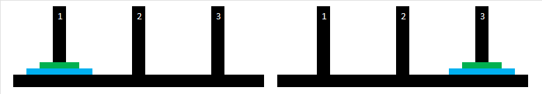
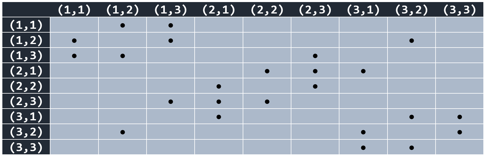
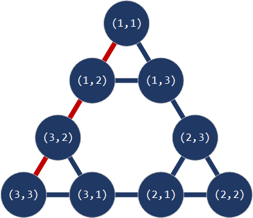

# Алгоритми претраживања

Алгоритми претраживања корисни су за решавање проблема у којима се групом
операција долази до решења. Циљ њиховог коришћења у системима вештачке
интелигенције је пронађи најбоље решење у простору могућих решења за дати
проблем.

Пре примене неког од алгоритама претраживања требаш дефинисати следеће:

* Шта је **стање** (опис тренутне ситуације у проблему)?
* Који су **оператори** (акције које је могуће предузети у одређеном стању, а
које могу да утичу на прелазак у друго стање)?
* Како изгледа **модел** (опис примене оператора у сваком могућем стању)?

Стања, оператори и модел дефинишу **простор стања проблема** који се може
представити **графом**. Стања представљају чворове графа, а оператори гране
графа. **Путања** представља секвенцу чворова повезаних гранама, односно
секвенцу стања повезаних операторима. **Цена путање** додељује се свакој путањи
и утиче на цену решења, из чега можеш закључити да је оптимално решење оно чија
је цена путање најмања.

Значи, алгоритми претраживања описују процес утврђивања најјефтиније путање
која води од почетног до циљног стања, односно до решења проблема.

## Пример примене алгоритма претраживања

Покушај да решиш проблем Ханојских кула - игру са три вертикална штапа `1`, `2`
и `3` и два диска `x` и `y` различитих пречника. На почетку дискови су
постављени на први штап по величини, а циљ је да их преместиш на трећи штап,
такође по величини. Правила су следећа:

* у сваком потезу премешташ по један диск, са врха једног на врх другог штапа и
* већи диск не смеш да преместиш на мањи.

<figure markdown="span">
  
  <figcaption>Почетно и циљно стање</figcaption>
</figure>

Простор стања можеш представити као `(x,y)`, где `x` и `y` могу имати вредност
`1`, `2` или `3`. Могућа су стања `(1,1)`, `(1,2)`, `(1,3)`, `(2,1)`, `(2,2)`,
`(2,3)`, `(3,1)`, `(3,2)` и `(3,3)`, под претпоставком да се у стањима `(1,1)`,
`(2,2)` и `(3,3)` мањи диск налази на већем, јер обрнутно по правилима није
дозвољено.

Из почетног стања је `(1,1)` могуће је прећи у стање `(1,2)` или у стање
`(1,3)`. Из стања `(1,2)` могуће је прећи у стања `(1,1)`, `(1,3)` и `(3,2)`
и тако даље.

### Табела прелаза

Све прелазе можеш представити табеларно:

<figure markdown="span">
  
  <figcaption>Табела прелаза</figcaption>
</figure>

Можеш приметити да је табела симетрична у односу на главне дијагонале.

### Граф претраге

Граф претраге можеш креирати на основу претходне табеле. У графу су стања
представљена чворовима, а премештања гранама.

<figure markdown="span">
  
  <figcaption>Граф претраге</figcaption>
</figure>
